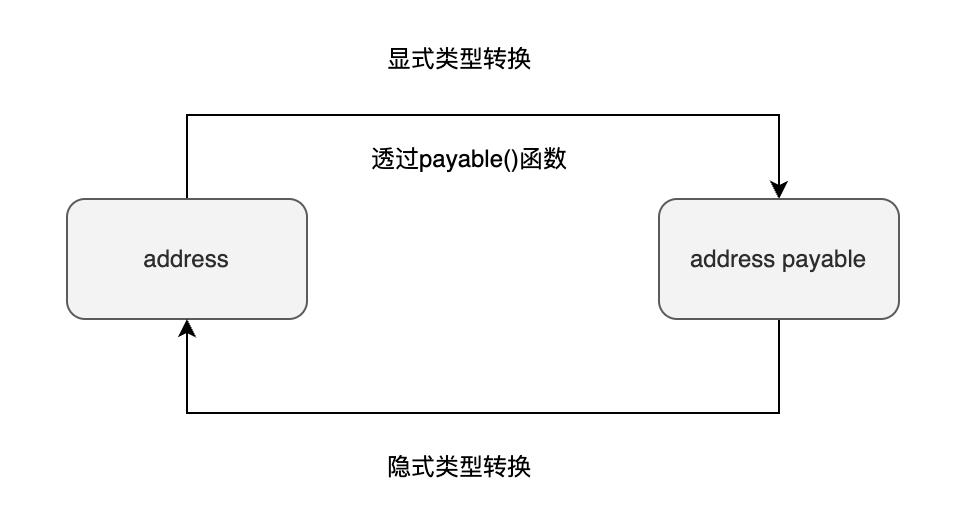

# 地址类型

地址类型（*address*）是Solidity独有的类型。在给其他账户转账，或者与其他合约交互的时候都需要用到地址类型。好比如你要向别人的银行账户转账，你需要知道对方的账户号码一样。Solidity的地址类型也扮演着类似的角色。

Solidity的地址类型用关键字 `address` 表示，它占据20bytes (*160bits*)，默认值为 `0x0` ，表示空地址。地址类型可以再细分为两种：

* `address` : 普通地址类型（不可接收转账）
* `address payable` : 可收款地址类型（可接收转账）

它们大部分的应用场景是相同的，主要的区别就是 `address payable` 能接受转账，但是 `address` 不行。之所以要进行这样的区分是因为有一些合约就是被设计了不接受转账的，所以这种状况下你应该使用 `address` 来指向合约地址。

## 定义地址类型变量

我们可以按照如下所示定义地址类型变量：

:::tip 定义地址类型变量

```solidity
address addr = 0x690B9A9E9aa1C9dB991C7721a92d351Db4FaC990;
address payable addr_pay = payable(0x8306300ffd616049FD7e4b0354a64Da835c1A81C);
```

:::

在Solidity中使用地址字面值（address literal）定义地址类型变量的时候不需要加 `””` 或者 `’’` ，只需要直接将地址字面值赋值给地址类型变量即可。注意到在定义 `addr_pay` 的时候我们使用了一个 `payable()` 的函数，这是用来将地址字面值显式转换成 `address payable` 类型的。下面我们讨论一下地址类型转换。

## 类型转换

`address` 和 `address payable` 之间的类型转换主要有两条规则。

01. `address payable`可以隐式地被转换成`address`
02. `address`需要显式地使用`payable(addr)`函数转换成`address payable`



:::tip 隐式类型转换(address payable to address) 

```solidity
address payable addr_pay = payable(0x8306300ffd616049FD7e4b0354a64Da835c1A81C);
address addr = addr_pay; // **隐式类型转换**
```

:::

:::tip 显式类型转换(address to address payable)

```solidity
address addr = 0x690B9A9E9aa1C9dB991C7721a92d351Db4FaC990;
address payable addr_pay = payable(addr); // **显式类型转换**
```

:::

## 成员变量

地址类型有三个成员变量，分别为：

* `balance`  ：地址的账户余额，单位是Wei
* `code`     ：地址的合约代码，可能为空
* `codehash` ：地址合约代码的hash值

:::tip 获取成员变量值 
下面展示了如何获取地址的成员变量。其中 `this` 代表的是当前合约。

```solidity
function get_balance() public view returns(uint256) {
     return address(this).balance; //获取地址账户余额
}

function get_code() public view returns(bytes memory) {
    return address(this).code; //获取合约代码
}

function get_codehash() public view returns(bytes32) {
    return address(this).codehash; //获取合约代码的hash值
}
```

:::

## 成员函数

* `transfer(uint256 amount)`: 向指定地址转账，不成功就抛出异常（仅address payable可以使用）
* `send(uint256 amount)`: 与 transfer 函数类似，但是失败不会抛出异常，而是返回布尔值 （仅address payable可以使用）
* `call(...)`: 调用其他合约中的函数
* `delegatecall(...)`: 与 call 类似，但是使用当前合约的上下文来调用其他合约中的函数，修改的也是当前合约的数据存储
* `staticcall(...)`: 于 call 类似，但是不会改变链上状态

### transfer

**函数签名**

```solidity
transfer(uint256 amount)
```

`transfer` 函数向目标地址发送给定 `amount` 的 Wei，如果发送失败，直接 `revert` 。执行 transaction 的 Gas 固定为2300。注意 `transfer` 函数仅 `address payable` 可以使用。


### send

**函数签名**

```solidity
send(uint256 amount) returns (bool)
```

`send` 函数向目标地址发送给定 `amount` 的 Wei ，如果发送失败，返回 `false` 。注意到 `send` 和 `transfer` 的区别是 `send` 返回 `false` ，而 `transfer` 直接 revert 。执行 transaction 的 Gas 同样固定为2300。注意 `send` 函数仅 `address payable` 可以使用。


#### transfer和send应该使用哪一个

`transfer` 和 `send` 都可以用来向另一个地址转账，那么我们应该选择用哪一个呢？答案是没有非常必要的理由，一律选 `transfer` 。因为 `transfer` 是 `send` 的改进版，目的是在转账不成功的时候直接revert transaction。而使用 `send` 时，你需要检查返回值看是否成功再决定做后续处理。有人可能忘记检查是否成功就进行下一步处理，导致合约有被攻击的风险。

但是目前来看(*2023年1月*)，这两个函数都不安全，都不推荐继续使用。更安全的方法是使用 `call` 函数来转账。如果你想要了解具体的原因，可以参看下面的这些讨论：

| 讨论内容 | 链接                                                                                                      |
| --- |---------------------------------------------------------------------------------------------------------|
| 讨论transfer与send的区别 | https://ethereum.stackexchange.com/questions/19341/address-send-vs-address-transfer-best-practice-usage |
| 讨论增加transfer来取代send | https://github.com/ethereum/solidity/issues/610 |
| stackexchange讨论transfer是否安全 | https://ethereum.stackexchange.com/questions/78124/is-transfer-still-safe-after-the-istanbul-update     |
| consensys建议停止使用transfer | https://consensys.net/diligence/blog/2019/09/stop-using-soliditys-transfer-now/                         |

### call

**函数签名**

```solidity
call(bytes memory) returns (bool, bytes memory)
```

使用 `call` 函数你可以与合约地址进行交互，调用其函数，或者直接向其转账。它有两个返回值，第一个是 `bool` ，显示函数调用是否成功。第二个是 `bytes memory` ，这个返回值是调用对方合约所返回的结果。与 `send` 和 `transfer` 所不同的是， `call` 函数可以指定Gas。使用 `call` 函数，我们也可以给其他地址转账，具体如何操作我们会在 `call` 函数的单独章节进行讨论。


### delegatecall

**函数签名**

```solidity
delegatecall(bytes memory) returns (bool, bytes memory)
```

`delegatecall` 是实现[代理模式](https://docs.openzeppelin.com/upgrades-plugins/1.x/proxies)的手段。通过使用 `delegatecall` 你可以让当前合约只使用给定地址的代码，而使用当前合约的存储（如状态变量，账户余额等）。Delegate这个词就有*代表，委派*的意思。例如A合约委派B合约做一些操作，B合约只是代劳这些操作，操作的最后状态变更都需要记录到A合约上面。基于 `delegatecall` 的这种特性，Openzeppelin提出了代理模式，让你可以升级你的合约。详情我们会在 `delegatecall` 的单独章节展开。


### [staticcall](https://eips.ethereum.org/EIPS/eip-214)

`staticcall` 与 `call` 非常类似。它们的唯一区别就是 `staticcall` 不会改变合约的状态（包括当前合约和外部合约），一旦在调用的过程中改变了合约的状态（包括状态变量变更，账户余额改变等），那么会直接revert。引入 `staticcall` 提高了合约的安全性，因为只要你使用了staticcall，你就可以肯定调用任何外部合约的函数不会对状态产生任何影响。而在引入 `stacticall` 之前，这是要通过阅读外部合约的代码来确保的。


# 参考资料

https://docs.soliditylang.org/en/v0.8.17/types.html#address
https://docs.soliditylang.org/en/v0.8.17/units-and-global-variables.html#address-related]
https://docs.openzeppelin.com/upgrades-plugins/1.x/proxies
https://eips.ethereum.org/EIPS/eip-214
https://cryptoguide.dev/post/guide-to-solidity's-staticcall-and-how-to-use-it

# 小结
01. Solidity 中的地址类型是用于转账和与其他合约交互的
02. 地址类型用 `address` 表示，占据20bytes (160bits)。默认值为`0x0`
03. 地址类型有两种：普通地址类型和可收款地址类型
04. 可收款地址类型可以接受转账，而普通地址类型不能
05. 可以使用 payable() 函数将地址字面值显式转换为可收款地址类型
06. `balance`：可以获取地址余额
07. `transfer()`：可以向指定地址转账
08. `send()`：与 `transfer()` 函数类似，但是如果转账失败会抛出异常
09. `call()`：可以调用其他合约中的函数
10. `delegatecall()`：与 `call()` 函数类似，但是使用当前合约的上下文来调用其他合约中的函数
11. `staticcall()`: 与 `call()` 函数类似，但是不会允许有改变状态变量的操作
12. `transfer()`和`send()` 函数只能在 `address payable` 类型中使用
