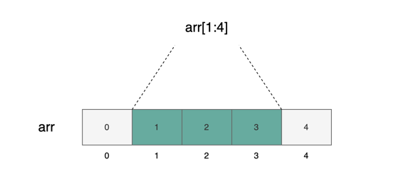

# 数组切片

数组切片（_array slice_）是基于数组建立的视图（_view_）。其语法为`arr[start:end]`。视图包含的是从`start`到`end-1`的元素。与数组不同的是，视图是没有类型的，也不能占据存储空间。它是为了方便我们对数据进行处理的一种抽象方式。

## 多种数组切片表示方式

如下图所示，底层数组`arr`一共有5个元素`[0, 1, 2, 3, 4]`。那么`arr[1:4]`的视图被涂成墨绿色，一共是3个元素。根据前面的定义，我们知道`start=1`，`end=4`。所以其包含的是从下标1到下标(4-1)=3的元素。



其中`start`和`end`都是可以被省略的。如果省略了`start`，那么会包含从`0`到`end-1`的元素：


如果省略了`end`那么会包含`start`到`arr.length - 1`的元素：


如果`start`和`end`都省略了，那么会包含`arr`所有元素：


## 数组切片示例

下面展示了一个数组切片截取字符串前4bytes的示例：

:::tip 数组切片截取字符串前4bytes
```solidity
// 如果输入"abcdef"，将会输出"abcd"
function extracFourBytes(string calldata payload) public view {
    string memory leading4Bytes = string(payload[:4]);
    console.log("leading 4 bytes: %s", leading4Bytes);
}
```
:::

##  数组切片只能使用在`calldata`数组

:::caution
目前只有`calldata`可以使用数组切片。`memory`和`storage`都不可以使用
:::

目前数组切片只能用在`calldata`数组身上，否则编译会报错。因为`calldata`数据是不可更改的，所以你也不能更改数组切片的值。

:::tip 编译错误：数组切片不能用在`memory`或者`storage`
```solidity
uint[5] memory arr1 = [uint(0), 1, 2, 3, 4];
uint[3] memory arrSlice1 = arr[1:4]; // 编译错误

uint[5] storage arr2 = [uint(0), 1, 2, 3, 4];
uint[3] storage arrSlice2 = arr[1:4]; // 编译错误
```
:::

