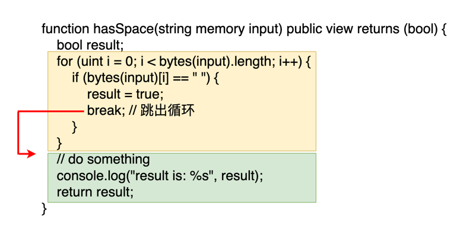

# break

在前几节我们学了三种循环 `for`, `while`, `do-while`。有时候我们会发现我们并不需要循环那么多次，当某些条件满足后就可以直接退出就好了。比如说判断字符串是否包含空格，只要找到一个空格我们就可以直接下结论了，不需要遍历完整一个字符串。这个时候我们就可以用到 `break` 关键字。

在 Solidity 中，break 关键字用于**提前退出循环**。使用它可以提高你的程序的执行效率,减少无用开销. 你可以在 `for`, `while`, `do-while` 循环使用 `break` 关键字. 我们通过一个例子来了解它的具体作用.

:::tip 判断字符串是否包含空格
下面的函数用来检查一个字符串里面是否含有空格。里面是一个从 `0` 到 `input.length` 的循环。一旦发现有空格就马上设置 `result=true` 并跳出循环。这样就不需要遍历整个字符串的每一个字符。
```solidity
function hasSpace(string memory input) public view returns (bool) {
    bool result;
    for (uint i = 0; i < bytes(input).length; i++) {
        if (bytes(input)[i] == " ") {
            result = true;
            break; // 跳出循环
        }
    }
    // do something
    console.log("result is: %s", result);
    return result;
}
```
:::

下图更形象展示了 break 的行为。黄色框框代表的循环代码块，绿色代表的是循环外的代码块。当执行到 break 的时候会跳出黄色框框，然后直接进入绿色框框的代码继续执行。



## break 只会跳出一层循环

假设你有多重循环，那 `break` 的行为是如何的呢。在这种情况，`break` 只会跳出一层循环，然后继续执行外部的循环。如下面的例子所示：

:::tip `break` 只会跳出一层循环
下面的例子中有两层循环，内层循环的 `break` 跳出来之后，会继续执行外层循环剩下的语句。所以你会看到 `continue excuting this statement after the inner loop break` 被打印了10次
```solidity
function breakOnlyOneLoop() public view {
    for(uint i = 0; i < 10; i++) {
        for(uint j = 0; j < 10; j++) {
            break;
            console.log("this statement would never execute");
        }
        console.log("continue excuting this statement after the inner loop break");
    }
}
```
:::

