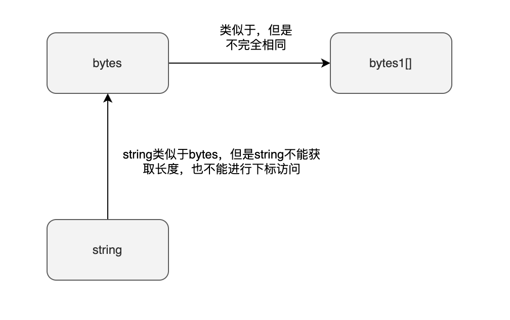

# 动态字节数组

前面介绍了静态字节数组，它的长度是固定的，而且最长也就只有32字节。那么如果我们希望存放超过32个字符怎么办。又或者我们希望它的长度可以变化的，可以按需增加的。这个时候我们就可以使用动态字节数组(*dynamically-sized byte array*)。动态字节数组其实是数组类型(array)其中的一种，只不过是字节数组而已。我们单独抽出来介绍是想要跟静态字节数组做对比。

:::info 动态字节数组是引用类型
特别注意动态字节数组是引用类型（*reference type*）
:::

## 动态字节数组与静态字节数组的区别

动态字节数组与静态字节数组有几点区别：

1. 静态字节数组长度是固定的，在编译期就已经确定；而动态字节数组的长度是不固定的
2. 静态字节数组的长度只能是1到32字节；而动态字节数组没有长度的限制
3. 动态字节数组是引用类型（*reference type*），也就是说其变量存储的其实是数组的地址；而静态字节数组是值类型（*value type*）

如果一个字节数组已经明确长度不会发生改变，而且长度小于等于32字节，那么建议使用静态字节数组。会更高效，更节省Gas。其他情况才推荐使用动态字节数组。

## 动态字节数组的种类

Solidity有两种动态字节数组：

- `bytes`
- `string`

其中`bytes`类似于`bytes1[]`不过`bytes`在`memory`和`calldata`位置会更加紧凑。而`string`是基本等同于`bytes`的类型，**但是它不能进行下标访问，也不能获取长度**。



## bytes与string的互相转换

bytes和string类型之间可以相互转换。需要用到：

- `bytes(str)`：           显式地将string转换成bytes
- `string(myBytes)`：  显式地将bytes转换成string


:::tip bytes转string 
```solidity
bytes memory bstr = new bytes(10);
string memory message = string(bstr); // 使用string()函数转换
```
:::

:::tip string转bytes 
```solidity
string memory message = "hello world";
bytes memory bstr = bytes(message); //使用bytes()函数转换
```
:::

## string 不能进行下标访问，也不能获取长度

虽然 `string` 也是数组但是目前还不支持它的下标访问和长度的获取。

:::tip `string` 不能进行下标访问，也不能获取长度
```solidity
string memory str = "hello world";
uint len = str.length; // 不合法，不能获取长度
bytes1 b = str[0]; // 不合法，不能进行下标访问
```

你可以将 `string` 转换成 `bytes` 后再进行下标访问和获取长度

:::tip 将 `string` 转换成 `bytes` 后再进行下标访问和获取长度
```solidity
uint len = bytes(str).length; // 合法
bytes1 b = bytes(str)[0]; // 合法
```
:::