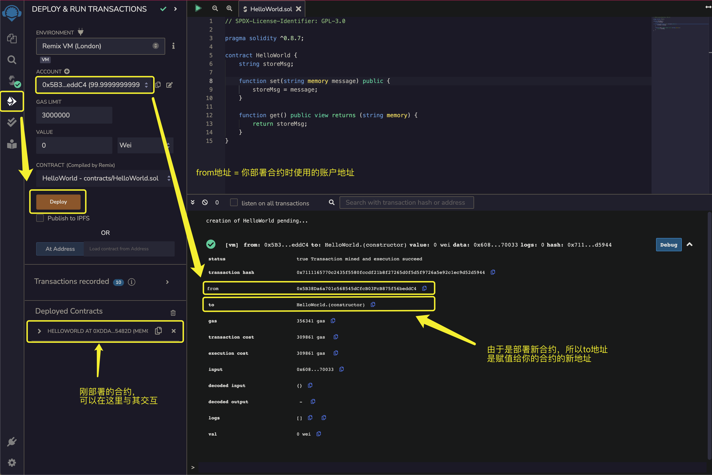

# Hello World!

跟其他编程语言一样，我们也通过编写一段简单的Hello World程序来展示Solidity的基本语法。这是确认编译器、程序开发或运行环境是否已经安装妥当的常用手段。

## Solidity Hello World!

下面的例子就是一个最简单的Hello World合约，它一共有两个函数，一个 `set` 函数用来将我们输入的字符串记录在 `storeMsg` 变量中，一个 `get` 函数从 `storeMsg` 中获取字符串。

:::tip Hello World!

```solidity
// SPDX-License-Identifier: GPL-3.0

pragma solidity ^0.8.17;

contract HelloWorld {
    string storeMsg;

    function set(string memory message) public {
        storeMsg = message;
    }

    function get() public view returns (string memory) {
        return storeMsg;
    }
}
```

<tryit fileName={ 'HelloWorld.sol' } />

:::

你可能会问，为什么我们不像C或者Python的Hello World一样直接打印一个Hello World字符串。这是因为Solidity是无法像其他程序一样自动运行的，它必须要由某个账户或者其他合约触发，并且支付足够的Gas才能执行其函数。所以我们要测试这个Hello World程序就必须要通过主动与其进行交互才能看到执行结果。

## 部署合约

按照之前的安装使用Remix IDE教程点击编译后，我们进入Deploy&Run Transactions面板，然后点击**Deploy**进行部署。部署完成后我们可以发现Terminal里面和Deployed Contract窗口分别弹出一条记录。我们先看Terminal里面的信息，展开后发现里面包括一些我们部署合约的状态信息(status)，部署合约的发起方(from)，新部署的合约地址(to)，使用的Gas等信息。我们可以看到合约部署状态为成功。所以我们可以在Deployed Contract窗口里面找到我们刚刚部署的合约。下一小节我们会介绍如何与我们的Hello World合约交互。



## 合约交互

如下图所示，我们分两步与合约进行交互，执行了两笔transaction，两笔transaction要分别付Gas。

* 第一步：调用`set(”hello world!”)`，将”hello world!”字符串写入`storeMsg`状态变量
* 第二步：调用`get()`，返回”hello world!”字符串


至此，我们成功与合约交互并且通过 `get` 函数获得了返回的”hello world!”字符串。大型的合约代码的开发也是基于相同的模式与流程，随着学习的不断深入，我们便可以开发越来越复杂的合约。

## 小结

在本节，我们介绍了一个简单的Hello World合约，以及部署并且展示了合约交互。在接下来的章节中我们会学到更多关于Solidity的合约结构，数据结构，控制结构等等内容。需要了解可以移步其他章节。
