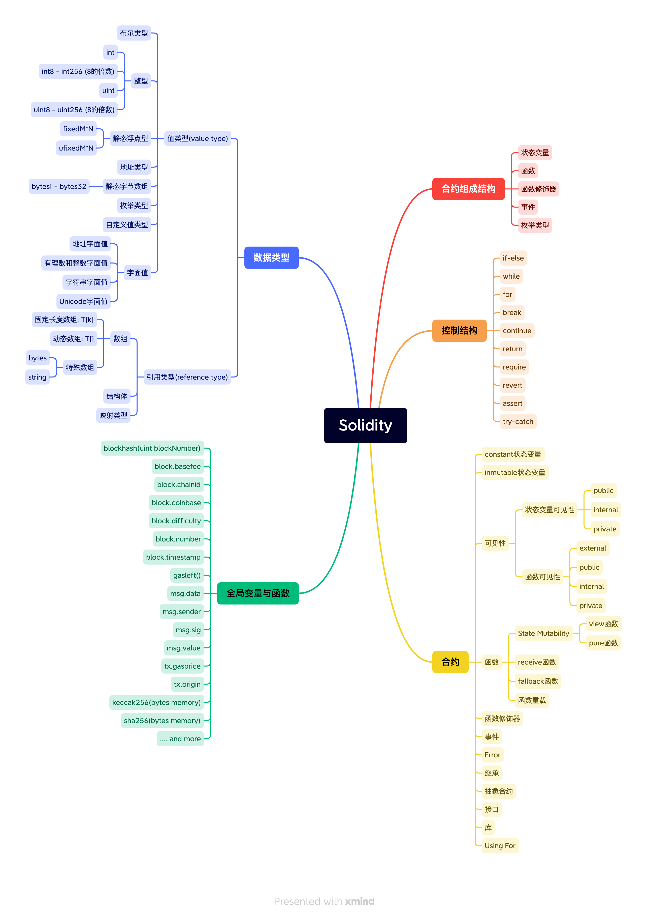

# Solidity简介

Solidity是由以太坊开发的一种高级编程语言，用于构建智能合约。它于2014年7月发布，并在过去几年中成为了区块链开发中最流行的智能合约编程语言之一, 并在许多大型区块链项目中使用。它拥有丰富的社区和生态系统，为开发人员提供了大量的工具和资源，帮助他们更轻松地开发智能合约。Solidity的发展与以太坊的发展密不可分。以太坊的智能合约功能使得Solidity在过去几年中得到了广泛的应用。众多重要的DeFi, NFT项目都由Solidity进行开发。例如我们耳熟能详的UniSwap，Compound, Aave等。

本教程是由WhatsWeb3 org出品的Web3入门系列教程之一。这个系列的教程涵盖了以下内容：

* **Solidity**: 合约开发语言，包括入门与进阶教程
* **Openzeppelin标准合约库**：由Openzeppelin维护的一系列标准合约，可以帮助加快合约开发
* **Ethernut**: 是一个游戏，上面部署了靶合约，让你进行攻击并学习安全知识
* **Hardhat & Truffle**: 合约测试部署框架
* **Web3.js**: 与合约进行交互的前端Javascript库

在这篇入门教程里面我们将会带你使用Solidity来进行基本的智能合约开发，你将会学到以下的内容：

* **环境搭建**：安装配置开发环境
* **基本概念**：包括 Solidity 的基本语法、变量类型、运算符、函数和控制结构
* **合约**：学习如何定义和使用 Solidity 中的合约类型，包括智能合约和库
* **生命周期**: 包括开发，部署，调用和升级
* **权限和安全**：了解如何使用 Solidity 中的权限检查和安全措施来保护你的合约
* **实践**：根据示例，练习使用 Solidity 编写和部署智能合约，并与其交互

下图是本篇教程的基本大纲：

除此之外，我们在进阶教程中会包含一些高级主题，包括 Solidity 的高级语法和特性，如何与其他合约进行交互。以及接口，继承等内容。详情可以参见《Solidity进阶指南》。

## 本篇教程适合哪些读者

本教程是 Solidity 入门教程，适合于对区块链和以太坊感兴趣的初学者。或者从 Web2 转型 Web3 的开发者。无需任何区块链或智能合约编程的经验，本教程将带领读者从基础开始学习 Solidity 语言，并通过实践操作学会如何编写和部署智能合约。通过本教程的学习，读者将能够掌握 Solidity 的基本语法和用法，并有能力编写自己的智能合约。

## 如何阅读

我们教程的所有章节都遵循着通俗易懂的原则来设计，可以简单介绍一下我们的思路，可以让我们的读者与贡献者都可以参考：

1. **概念引入**：每个章节都会有概念引入部分，帮助你了解这个新概念是什么，存在的意义是什么，与其他概念有何联系
2. **大量使用图片**：人类是视觉动物，一段文字怎么看都不懂，往往一张图片在几秒钟就能传达最重要的信息
3. **大量使用示例**：一个具体例子胜过千言万语。我们所有教程都是围绕示例开展的。Example First 是我们编写教程的第一原则
4. **只包含最重要的内容**：不让你感觉被堆砌了太多无关的知识
5. **将内容分成较小的部分**：分解成较小的章节或小节，让你能够更容易地理解
6. **使用通俗易懂的语言**：避免使用过于抽象或专业的术语
7. **未经定义的术语不要使用**：术语使用前必须先定义，而且保持一致，不随意更换成同义词
8. **提供足够的背景知识**：解释一些可能不熟悉的概念，让读者能够理解到底在讲什么
9. **连接新概念与实际应用**：使用实际的例子来帮助你理解如何将所学的知识应用到实际的项目中
10. **反复强调重要内容**：重要的内容反复强调，说不清的道理多举例子
10. **提供内容小结**：每章节都提供内容小结，让读者回顾这节的重要内容，以及这篇内容与其他的章节有什么联系。说明接下来要介绍什么内容

## 开始学习

总的来说，使用Solidity编写智能合约是一项技术挑战，但是通过努力学习和实践，任何人都可以成为优秀的智能合约开发人员。我们一起开启学习旅程吧。

对于本教程如果有任何反馈也欢迎与我们联系。

